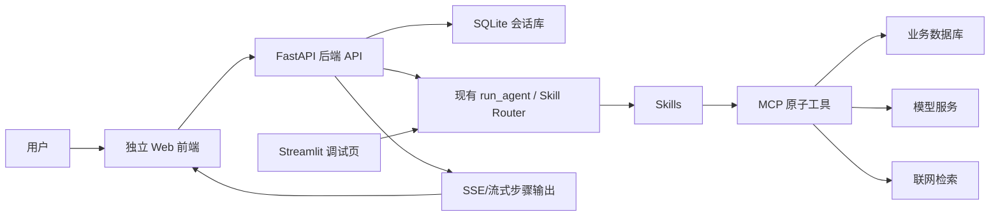

# codex_前端优化版本_20260605

> 目标：将当前 ChatBI PoC 从 Streamlit 调试界面升级为独立 Web 端生产页面。新页面以 `前端原型/web端AI助手_2/index.html` 中“助手放大态”为视觉基准，复用现有 Skill + MCP + Prompt + SQL + 联网检索后端能力，Streamlit 保留为后台调试页。

## 1. 核心结论

本次前端优化不是继续给 Streamlit 换皮，而是新增一个独立 Web 生产前端。

最终产品形态：

| 项目 | 决策 |
|---|---|
| 生产入口 | 独立 Web 页面 |
| 视觉基准 | 现有前端原型的助手放大态 |
| 样式复原目标 | 至少 95% 复原原型 |
| 后端编排 | 保持现有 Skill + MCP 逻辑方式不变 |
| Streamlit | 保留为后台调试、UAT、开发验收页面 |
| 会话存储 | 本地 SQLite |
| 联网搜索 | 由用户开关决定；开启后内部数据问题也要结合外部联网资料 |

## 2. 必须遵守的硬约束

### 2.1 样式复原

生产 Web 页必须至少 95% 复原用户提供的原型样式。

必须复原：

- 整体浅色风格、红色品牌色、卡片边界、阴影、圆角、字体层级。
- 顶部标题区、历史侧栏、消息列表、用户/助手头像、输入框、发送按钮。
- 会话历史卡片、置顶、重命名、删除、新建对话。
- 思考过程步骤样式、运行中状态、完成状态、错误状态。
- 联网搜索开关、输入框工具栏、按钮 hover/active/disabled 状态。
- 原型中的图标资源优先复用 `前端原型/web端AI助手_2/assets/`。

允许调整：

- 原型是悬浮窗口，本次实现为独立整页，因此可以把放大态作为页面主体，进行必要的宽高自适配。
- 原型中的静态假数据可以替换为真实后端返回数据。
- 步骤数量、步骤名称、步骤内容由真实 Skill/MCP 执行链路决定。

不允许：

- 重新设计一套视觉风格。
- 将页面做成看板门户或右下角悬浮机器人。
- 用 Streamlit 作为生产页面承载层。

### 2.2 Skill + MCP 逻辑

现有 Skill + MCP 的业务编排逻辑保持不变。前端只负责展示真实执行链路，不把原型里的固定步骤反向写死到后端。

当前已有核心能力：

| 能力 | 当前实现 |
|---|---|
| 普通闲聊 | `chat` Skill |
| 内部数据查询 | `data_query` Skill |
| 同环比分析 | `yoy_yoy_analysis` Skill |
| 显式联网问答 | `web_search_answer` Skill |
| 上下文外部对比 | `web_compare_analysis` Skill |
| 内部数据 + 外部对比 | `data_web_compare_analysis` Skill |
| 原子工具 | `llm`、`knowledge_retrieval`、`n2sql`、`sql_executor`、`web_search`、`time`、`text_analysis` 等 |

前端思考过程展示规则：

- 每个真实 `thought_process` 节点都渲染为一个步骤。
- 步骤标题来自后端节点语义，例如意图识别、知识检索、N2SQL、SQL 执行、联网检索、数据解读。
- 步骤数量不固定，由实际 Skill/MCP 决定。
- 每个步骤应支持状态、耗时、摘要、入参、出参、LLM 输出、错误详情展示。
- 成功态默认可以收起详情，错误态应自动展开。

### 2.3 联网搜索业务规则

联网搜索由用户显式开关决定。

规则如下：

| 用户联网开关 | 用户问题类型 | 后端行为 |
|---|---|---|
| 关闭 | 问内部数据 | 只走内部数据 Skill/MCP |
| 关闭 | 问普通问题 | 正常路由，不主动联网 |
| 关闭 | 明确要求联网 | 提示需要开启联网搜索，或前端引导用户打开开关 |
| 开启 | 问普通公开问题 | 允许走联网搜索 Skill |
| 开启 | 问内部数据 | 必须查询内部数据，同时补充外部联网资料并综合分析 |
| 开启 | 多轮追问 | 结合上文内部结果和外部资料做对比分析 |

关键理解：

> 用户打开联网搜索后，即使问的是内部数据，也代表用户希望答案包含外部数据或公开资料视角。因此后端不能只返回内部数据，应走“内部数据 + 外部联网资料 + 综合分析”的链路。

## 3. 总体架构



建议新增：

- `api_server.py`：HTTP API 与 SSE 流式输出入口。
- `chat_repository.py`：SQLite 会话与消息持久化。
- `web_frontend/`：独立 Web 前端工程。

保留：

- `streamlit_langgraph.py`：后台调试页。
- `langgraph_cot.py`：Skill 路由与工作流执行器。
- `skills/`、`mcps/`、`prompts/`：业务能力层。

## 4. 后端 API 设计

### 4.1 会话 API

| 方法 | 路径 | 用途 |
|---|---|---|
| `GET` | `/api/sessions` | 获取会话列表 |
| `POST` | `/api/sessions` | 新建会话 |
| `GET` | `/api/sessions/{session_id}` | 获取会话详情和消息 |
| `PATCH` | `/api/sessions/{session_id}` | 重命名、置顶、更新会话 |
| `DELETE` | `/api/sessions/{session_id}` | 删除会话 |

### 4.2 聊天 API

建议第一版使用 SSE：

| 方法 | 路径 | 用途 |
|---|---|---|
| `POST` | `/api/chat` | 创建用户消息并启动一次回答 |
| `GET` | `/api/chat/stream/{run_id}` | 流式返回步骤和最终答案 |

也可以合并为一个 `POST /api/chat/stream`，直接返回 `text/event-stream`。具体实现时以 FastAPI 最简稳定方案为准。

聊天请求字段：

```json
{
  "session_id": "uuid",
  "message": "查询2024年中东公司终端量，并分析原因",
  "web_search_enabled": true
}
```

流式事件类型：

| 事件 | 含义 |
|---|---|
| `message_created` | 用户消息已保存 |
| `step_started` | 步骤开始 |
| `step_completed` | 步骤完成 |
| `sql_preview` | SQL 表格或图表预览可提前展示 |
| `answer_delta` | 最终答案增量文本 |
| `answer_completed` | 最终答案完成 |
| `error` | 执行失败 |

## 5. SQLite 数据设计

### 5.1 sessions

| 字段 | 类型 | 说明 |
|---|---|---|
| `id` | TEXT PRIMARY KEY | 会话 ID |
| `title` | TEXT | 会话标题 |
| `summary` | TEXT | 会话摘要 |
| `is_pinned` | INTEGER | 是否置顶 |
| `created_at` | TEXT | 创建时间 |
| `updated_at` | TEXT | 更新时间 |
| `last_mode` | TEXT | 最近执行类型，可选 |
| `last_web_search_enabled` | INTEGER | 最近是否开启联网 |

### 5.2 messages

| 字段 | 类型 | 说明 |
|---|---|---|
| `id` | TEXT PRIMARY KEY | 消息 ID |
| `session_id` | TEXT | 会话 ID |
| `role` | TEXT | `user` 或 `assistant` |
| `content` | TEXT | 消息内容 |
| `selected_skill` | TEXT | 后端选择的 Skill |
| `web_search_enabled` | INTEGER | 本轮是否开启联网 |
| `trace_open` | INTEGER | 思考过程默认是否展开 |
| `created_at` | TEXT | 创建时间 |

### 5.3 message_steps

| 字段 | 类型 | 说明 |
|---|---|---|
| `id` | TEXT PRIMARY KEY | 步骤 ID |
| `message_id` | TEXT | 关联助手消息 |
| `step_index` | INTEGER | 步骤序号 |
| `step_type` | TEXT | 节点类型 |
| `title` | TEXT | 前端显示标题 |
| `status` | TEXT | `running`、`completed`、`failed` |
| `summary` | TEXT | 步骤摘要 |
| `mcp_name` | TEXT | MCP 名称 |
| `mcp_input` | TEXT | JSON 入参 |
| `mcp_output` | TEXT | JSON 出参 |
| `llm_output` | TEXT | LLM 输出 |
| `error` | TEXT | 错误信息 |
| `duration_ms` | INTEGER | 耗时 |
| `created_at` | TEXT | 创建时间 |

## 6. 前端页面设计

### 6.1 页面组成

独立 Web 页面采用原型助手放大态布局：

- 左侧：历史会话面板。
- 右侧顶部：助手标题、在线状态、会话操作。
- 右侧中部：消息列表与思考过程。
- 右侧底部：输入区、联网搜索开关、发送按钮。

### 6.2 前端组件

建议组件拆分：

| 组件 | 职责 |
|---|---|
| `AppShell` | 页面整体布局 |
| `HistoryPanel` | 历史会话列表 |
| `HistoryCard` | 单个会话卡片 |
| `ChatHeader` | 顶部标题和操作区 |
| `MessageList` | 消息列表 |
| `MessageBubble` | 用户/助手消息气泡 |
| `ThoughtProcess` | 思考过程容器 |
| `ThoughtStep` | 单个 Skill/MCP 步骤 |
| `ResultRenderer` | 数据表、图表、分析、口径、联网来源渲染 |
| `ChatInput` | 输入框、联网开关、发送按钮 |
| `RenameDialog` | 重命名弹窗 |
| `DeleteDialog` | 删除确认弹窗 |

### 6.3 样式资源

优先复用原型资源：

- `assets/assistant-avatar.png`
- `assets/user-avatar.png`
- `assets/icons/history-pin.svg`
- `assets/icons/history-unpin.svg`
- `assets/icons/helper-entry.svg`
- `assets/icons/mode-thinking.svg`

样式迁移策略：

1. 从原型 CSS 中抽取助手放大态相关样式。
2. 删除业务看板、悬浮入口、拖拽浮窗相关样式。
3. 保留历史面板、消息区、输入区、思考过程、弹窗、tooltip 等样式。
4. 将固定浮窗尺寸改为响应式整页尺寸。
5. 用 Playwright 截图对比原型与新页面，逐轮修正。

## 7. 后端路由调整

新增 `web_search_enabled` 参数后，后端路由策略需要补充：

### 7.1 关闭联网

保持当前自动路由能力，但禁止主动使用 `web_search`。

处理策略：

- 内部数据问题：`data_query` 或 `yoy_yoy_analysis`。
- 闲聊问题：`chat`。
- 用户明确要求联网但开关关闭：返回提示，要求开启联网搜索。

### 7.2 开启联网

只要用户开启联网搜索，本轮问题允许且优先结合外部资料。

处理策略：

- 内部数据问题：优先 `data_web_compare_analysis`。
- 基于上文内部数据追问：优先 `web_compare_analysis`。
- 纯公开信息问题：优先 `web_search_answer`。
- 同环比问题如果同时开启联网：先完成内部同环比查询，再追加联网公开市场分析；第一版可通过新增组合 Skill 或扩展 `data_web_compare_analysis` 实现。

### 7.3 建议实现方式

为了最小化破坏现有逻辑，建议：

1. 给 `run_agent` 增加可选参数 `web_search_enabled: bool = False`。
2. 在 `step1_select_skill` 前置上下文路由中优先读取该参数。
3. 当 `web_search_enabled=True` 且检测到内部数据意图时，路由到 `data_web_compare_analysis`。
4. 当 `web_search_enabled=False` 时，屏蔽联网类 Skill 的选择。
5. 保持 Skill 文件和 MCP 执行器的主体逻辑不变。

## 8. 实施任务拆分

### Task 1：新增 SQLite 会话仓储

文件：

- 新增 `chat_repository.py`
- 新增 `tests/test_chat_repository.py`

验收：

- 可以创建、查询、重命名、置顶、删除会话。
- 可以保存用户消息、助手消息和步骤。
- 测试在临时 SQLite 文件中运行，不污染生产数据。

### Task 2：扩展 run_agent 联网开关

文件：

- 修改 `langgraph_cot.py`
- 修改 `tests/test_workflow.py`

验收：

- `web_search_enabled=False` 时，内部数据问题不触发 `web_search`。
- `web_search_enabled=True` 时，内部数据问题进入内部数据 + 联网分析链路。
- 明确联网但开关关闭时，返回清晰提示。

### Task 3：新增 FastAPI 服务

文件：

- 新增 `api_server.py`
- 修改 `requirements.txt`
- 新增 `tests/test_api_server.py`

验收：

- `GET /api/sessions` 返回会话列表。
- `POST /api/sessions` 可创建会话。
- `POST /api/chat` 可调用现有后端并保存结果。
- 流式接口可返回真实步骤事件。

### Task 4：新建 Web 前端工程

文件：

- 新增 `web_frontend/`
- 新增 `web_frontend/src/`
- 复制原型所需 `assets/`

验收：

- `npm install` 后可启动。
- 页面首屏是独立 Web AI 助手，不出现业务看板门户。
- 视觉结构接近原型助手放大态。

### Task 5：实现会话管理 UI

文件：

- `web_frontend/src/components/HistoryPanel.tsx`
- `web_frontend/src/components/HistoryCard.tsx`
- `web_frontend/src/components/RenameDialog.tsx`
- `web_frontend/src/components/DeleteDialog.tsx`

验收：

- 支持新建、切换、置顶、重命名、删除会话。
- 刷新页面后历史仍存在。
- 样式与原型历史面板保持一致。

### Task 6：实现聊天与思考过程 UI

文件：

- `web_frontend/src/components/MessageList.tsx`
- `web_frontend/src/components/MessageBubble.tsx`
- `web_frontend/src/components/ThoughtProcess.tsx`
- `web_frontend/src/components/ThoughtStep.tsx`
- `web_frontend/src/components/ChatInput.tsx`

验收：

- 用户消息即时出现。
- 助手步骤按后端事件实时追加。
- 步骤数量动态变化，不写死原型步骤。
- 错误步骤自动展开。
- 输入区、联网开关、发送按钮样式复原原型。

### Task 7：实现结果渲染

文件：

- `web_frontend/src/components/ResultRenderer.tsx`
- `web_frontend/src/components/DataTable.tsx`
- `web_frontend/src/components/EChartsPanel.tsx`

验收：

- 能渲染 Markdown 表格。
- 能渲染 ECharts 图表。
- 能分区展示业务分析、统计口径、联网来源。
- SQL 表格返回后可以先显示预览，不必等待最终分析文本完成。

### Task 8：联调真实数据

文件：

- `api_server.py`
- `web_frontend/src/api/client.ts`

验收：

- Web 前端可以用当前 real 配置查询真实业务数据库。
- 与 Streamlit 查询同一问题时，后端链路和结果一致。
- 联网开关开启时，返回包含外部公开资料分析。

### Task 9：视觉验收与修正

文件：

- `web_frontend/src/styles/`
- 相关组件样式文件

验收：

- 使用 Playwright 分别截图原型和新页面。
- 对比历史面板、消息区、输入区、步骤区、弹窗。
- 达到至少 95% 样式复原。
- 桌面宽屏和窄屏均无文本重叠、横向溢出、按钮错位。

## 9. 验收标准

### 9.1 功能验收

- 可以新建会话。
- 可以发送问题并得到真实回答。
- 可以看到真实 Skill/MCP 执行步骤。
- 可以打开/关闭联网搜索。
- 可以置顶、重命名、删除历史会话。
- 可以刷新页面后保留历史。
- 可以在 Streamlit 中继续调试原有能力。

### 9.2 业务验收

建议首批验收问题：

| 场景 | 问题 | 联网开关 | 期望 |
|---|---|---|---|
| 内部数据 | `2024年中东公司终端量是多少？` | 关闭 | 只查内部数据 |
| 内部 + 外部 | `2024年中东公司终端量是多少？` | 开启 | 内部数据 + 外部资料分析 |
| 联网公开信息 | `网上搜一下最近中东汽车市场趋势` | 开启 | 联网检索回答 |
| 联网关闭提示 | `网上搜一下最近中东汽车市场趋势` | 关闭 | 提示开启联网 |
| 多轮追问 | `和竞品对比呢？` | 开启 | 复用上文内部结果 + 联网对比 |
| 同环比 | `2024年中东公司终端量同比去年怎么样？` | 关闭 | 内部同环比分析 |

### 9.3 视觉验收

- 与原型助手放大态整体观感一致。
- 历史面板、消息气泡、输入框、步骤过程、弹窗至少 95% 复原。
- 不出现 Streamlit 组件痕迹。
- 不出现看板门户主体。
- 页面适配常见桌面浏览器宽度。

## 10. 风险与处理

| 风险 | 影响 | 处理 |
|---|---|---|
| 原型为静态 HTML，生产前端需要状态管理 | 中 | 用 React 组件拆分，样式先迁移再接 API |
| 后端当前非 HTTP 服务 | 中 | 新增 FastAPI 包装，不重写现有执行器 |
| 流式步骤与最终答案并发保存复杂 | 中 | 第一版先顺序写入，稳定后再优化增量保存 |
| 联网开关改变 Skill 路由 | 高 | 只在路由层加参数，不改 MCP 原子能力 |
| 95% 视觉复原耗时 | 高 | 以 Playwright 截图对比为验收依据，优先复刻核心区域 |
| SQLite 并发写入 | 低 | 单机本地使用足够，写入加连接超时和事务 |

## 11. 建议执行顺序

1. 建 SQLite 会话层。
2. 给 `run_agent` 增加联网开关。
3. 新增 FastAPI API。
4. 新建 Web 前端并迁移原型样式。
5. 接会话 API。
6. 接聊天 API 和流式步骤。
7. 接真实数据与联网搜索。
8. 做视觉 95% 复原验收。
9. 更新 README 和日常开发命令。

## 12. 推荐启动命令

后端：

```bash
APP_MODE=mock uvicorn api_server:app --host 127.0.0.1 --port 8000 --reload
```

前端：

```bash
cd web_frontend
npm install
npm run dev
```

Streamlit 调试页：

```bash
APP_MODE=mock streamlit run streamlit_langgraph.py --server.address 127.0.0.1 --browser.gatherUsageStats false
```

## 13. 当前状态

截至 2026-06-05：

- 原型已确认：以助手放大态作为生产 Web 页面。
- Streamlit 保留：作为后台调试页。
- 后端能力已确认：复用现有 Skill + MCP，不推倒重来。
- 样式要求已确认：至少 95% 复原原型。
- 联网策略已确认：用户打开联网后，内部数据问题也要结合外部资料。
- 第一版生产 Web 入口已实施：新增 SQLite 会话层、FastAPI API、React/Vite 前端工程和联网开关路由。
- 已完成 mock 模式 SIT/UAT：自动化回归、MCP mock 健康检查、API 级首批业务验收均通过。
- 待完成：前端 npm 工具链补齐后执行 Vite build、浏览器联调、Playwright 视觉截图对比和 Real 模式 UAT。

## 14. 2026-06-05 SIT/UAT 结果

### 14.1 实施完成情况

| 任务 | 状态 | 说明 |
|---|---|---|
| Task 1：新增 SQLite 会话仓储 | DONE | 新增 `chat_repository.py`，测试覆盖会话、消息、步骤保存 |
| Task 2：扩展 run_agent 联网开关 | DONE | `run_agent` 增加 `web_search_enabled`，关闭时拦截显式联网，开启时内部数据进入内外部综合分析 |
| Task 3：新增 FastAPI 服务 | DONE | 新增 `api_server.py`，提供会话 API、聊天 API、简版 SSE |
| Task 4：新建 Web 前端工程 | DONE_WITH_BUILD_BLOCKED | 新增 `web_frontend/`，复制原型资源；当前环境缺 npm，未能执行 build |
| Task 5：实现会话管理 UI | DONE_STATIC | 已实现新建、切换、置顶、重命名、删除组件与 API 调用 |
| Task 6：实现聊天与思考过程 UI | DONE_STATIC | 已实现消息、头像、思考过程、步骤详情、输入框、联网开关 |
| Task 7：实现结果渲染 | PARTIAL | 已支持 Markdown 标题、引用、表格渲染；ECharts 组件为占位，后续接结构化图表 |
| Task 8：联调真实数据 | PENDING_REAL_UAT | 本轮使用 mock 模式；Real 需真实凭据与网络环境复测 |
| Task 9：视觉验收与修正 | BLOCKED | 当前 PATH 缺少 `npm`/`pnpm`/`yarn`/`tsc`，无法启动前端和截图对比 |

### 14.2 SIT 结果

| 验收项 | 状态 | 证据 |
|---|---|---|
| 自动化回归 | PASS | `45 passed, 1 warning in 0.24s` |
| MCP mock 健康检查 | PASS | `llm`、`n2sql`、`sql_executor`、`knowledge_retrieval`、`web_search`、`time`、`text_analysis` 均 OK |
| SQLite 会话层 | PASS | `tests/test_chat_repository.py` 覆盖创建、查询、重命名、置顶、删除、消息和步骤 |
| FastAPI 基础接口 | PASS | `tests/test_api_server.py` 覆盖会话列表、新建会话、聊天保存、步骤返回 |
| 前端静态工程 | PASS | 关键组件、API client、样式、原型资源均存在 |
| 前端 build | BLOCKED | Node 存在，但未发现 `npm`、`pnpm`、`yarn`、`tsc` |

### 14.3 UAT 首批验收问题

| 场景 | 问题 | 联网开关 | 实际路由 | 结果 |
|---|---|---|---|---|
| 内部数据 | `2024年中东公司终端量是多少？` | 关闭 | `data_query` | PASS |
| 内部 + 外部 | `2024年中东公司终端量是多少？` | 开启 | `data_web_compare_analysis` | PASS |
| 联网公开信息 | `网上搜一下最近中东汽车市场趋势` | 开启 | `web_search_answer` | PASS |
| 联网关闭提示 | `网上搜一下最近中东汽车市场趋势` | 关闭 | 无 Skill，返回开启联网搜索提示 | PASS |
| 多轮追问 | `和竞品对比呢？` | 开启 | `web_compare_analysis` | PASS |
| 同环比 | `2024年中东公司终端量同比去年怎么样？` | 关闭 | `yoy_yoy_analysis` | PASS |

### 14.4 新增/更新文件

| 文件 | 说明 |
|---|---|
| `chat_repository.py` | SQLite 会话、消息、思考步骤持久化 |
| `api_server.py` | FastAPI 生产 Web API |
| `web_frontend/` | React/Vite 前端工程 |
| `tests/test_chat_repository.py` | 会话仓储测试 |
| `tests/test_api_server.py` | API 测试 |
| `tests/test_workflow.py` | 联网开关路由测试 |
| `qa/SIT_20260605_前端优化生产Web入口测试报告.md` | 本轮 SIT 报告 |
| `qa/UAT_20260605_前端优化生产Web入口验收报告.md` | 本轮 UAT 报告 |
| `history/10_20260605_前端优化生产Web入口SIT_UAT总结.md` | 本轮开发与验收总结 |

### 14.5 OPEN 问题与下一步

| 编号 | 问题 | 状态 | 下一步 |
|---|---|---|---|
| OPEN-01 | 当前环境缺少 npm 工具链 | OPEN | 安装 npm 或提供可用包管理器 |
| OPEN-02 | 前端 build 和 dev server 未验证 | OPEN | 执行 `cd web_frontend && npm install && npm run build` |
| OPEN-03 | 95% 视觉复原未截图确认 | OPEN | 前端启动后用 Playwright 对比原型和生产页面 |
| OPEN-04 | 当前 UAT 为 mock 模式 | OPEN | Real 凭据和网络确认后补真实数据/联网 UAT |
| OPEN-05 | SSE 第一版为顺序输出 | OPEN | 后续接入 `run_agent` callback，实现运行中事件实时推送 |

## 15. 2026-06-05 前端构建与浏览器 smoke 复测

用户指出 npm 可由 Codex 自行安装后，已继续完成前端构建和浏览器级 smoke。

### 15.1 npm 与 Rollup 处理

当前环境的 `node` 来自 `Codex.app`，默认不附带 `npm`。本轮在项目内临时解出 npm runtime：

```bash
.system_generated/npm-runtime/package/bin/npm-cli.js
```

直接使用 Rollup native 可选依赖时，Codex.app Node 在 macOS 下触发原生模块代码签名限制。处理方式是在 `web_frontend/package.json` 中将 `rollup` 覆盖为 wasm 版本：

```json
"rollup": "npm:@rollup/wasm-node@^4.27.1"
```

### 15.2 复测结果

| 项目 | 状态 | 证据 |
|---|---|---|
| 前端依赖安装 | PASS | npm install 成功 |
| 前端 build | PASS | `npm run build` 成功，Vite 输出 `dist/` |
| 后端 dev server | PASS | FastAPI mock 服务启动于 `127.0.0.1:8010` |
| 前端 dev server | PASS | Vite 服务启动于 `127.0.0.1:5173` |
| HTTP smoke | PASS | `/api/sessions` 和 `/` 均返回 200 |
| Playwright 页面 smoke | PASS | 页面标题 `广汽国际 AI 助手` |
| Playwright 交互 smoke | PASS | 自动创建会话，发送内部数据问题，渲染 `data_query`、8 个思考步骤和结果表格 |
| 截图证据 | PASS | `output/playwright/chatbi-web-smoke-20260605.png` |

### 15.3 更新后的状态

| 任务 | 更新状态 |
|---|---|
| Task 4：新建 Web 前端工程 | DONE，构建已通过 |
| Task 5：实现会话管理 UI | DONE，浏览器 smoke 已验证自动创建与历史展示 |
| Task 6：实现聊天与思考过程 UI | DONE，浏览器 smoke 已验证发送、回答、思考步骤 |
| Task 9：视觉验收与修正 | PARTIAL，已完成生产页 smoke 截图；仍需与原型并排对比后继续修正 |

剩余 OPEN 项：

| 编号 | 问题 | 下一步 |
|---|---|---|
| OPEN-03 | 95% 视觉复原未完成原型对比验收 | 用 Playwright 分别截图原型和生产页面，继续修正视觉差异 |
| OPEN-04 | 当前 UAT 为 mock 模式 | Real 凭据和网络确认后补真实数据/联网 UAT |
| OPEN-05 | SSE 第一版为顺序输出 | 后续接入 `run_agent` callback，实现运行中事件实时推送 |

## 16. 2026-06-06 浏览器视觉验收反馈修正

### 16.1 用户反馈与修正结果

| 编号 | 浏览器验收反馈 | 修正结果 | 状态 |
|---|---|---|---|
| VISUAL-01 | 联网搜索需要按照原型样式 | 替换滑块为原型地球图标胶囊按钮，显示 `ON/OFF` 状态 | PASS |
| VISUAL-02 | 历史对话缺少收缩按钮 | 顶部新增原型式历史按钮，支持收缩与重新展开 | PASS |
| VISUAL-03 | 用户消息颜色未按原型 | 用户消息改为原型放大态黑色渐变 | PASS |
| VISUAL-04 | 输入工具栏不应显示“智能问答” | 移除“智能问答”和分隔线，工具栏仅保留联网搜索 | PASS |
| VISUAL-05 | 发送按钮颜色需与原型一致 | 可用态改为原型黑色渐变和 SVG 发送图标，禁用态保持灰色 | PASS |

### 16.2 实现与测试

- 新增 `tests/test_web_frontend_contract.py`，锁定侧栏收缩、联网按钮、工具栏内容和黑色品牌样式。
- 浏览器验证历史侧栏收缩后 `grid-template-columns` 为 `0px 1342px`，面板 `visibility=hidden`。
- 浏览器验证输入工具栏仅有一个按钮，文本为 `联网搜索 ON/OFF`，不包含“智能问答”。
- 浏览器验证用户消息和可用发送按钮背景为 `linear-gradient(135deg, #252525 0%, #050505 100%)`。

### 16.3 SIT 结果与截图

| 项目 | 结果 | 证据 |
|---|---|---|
| 前端契约测试 | PASS | `3 passed` |
| 全量自动化回归 | PASS | `48 passed, 1 warning in 0.30s` |
| MCP mock 健康检查 | PASS | 7 个 MCP 均 OK |
| 前端生产构建 | PASS | `tsc -b && vite build` |
| 展开态截图 | PASS | `qa/SIT_20260606_前端视觉修正_展开态.png` |
| 历史收缩态截图 | PASS | `qa/SIT_20260606_前端视觉修正_历史收缩态.png` |
| 联网开启与发送可用态截图 | PASS | `qa/SIT_20260606_前端视觉修正_联网开启发送可用态.png` |

### 16.4 当前开发状态

- 用户本轮浏览器视觉反馈已全部关闭，可以继续后续完整开发。
- 下一开发项：将顺序输出的简版 SSE 改造为基于 `run_agent(callback=...)` 的运行中实时步骤推送。
- 后续每轮 SIT 继续保存关键状态截图到 `qa/`，并持续更新本文档。

## 17. 2026-06-06 实时 SSE 步骤推送开发

### 17.1 改造内容

- `POST /api/chat/stream` 不再先等待完整回答后顺序回放步骤。
- API 在创建用户消息后立即返回 `message_created`。
- `run_agent(callback=...)` 在后台线程执行，真实步骤 callback 通过异步队列即时转换为 `step_completed` SSE 事件。
- `run_agent` callback 从模块级全局变量改为 `ContextVar` 请求上下文隔离，避免并发会话互相覆盖流式事件。
- 每个 callback 步骤到达时立即保存到 SQLite，不再等待最终答案统一保存。
- Agent 完成后更新助手消息与会话状态，并发送 `answer_completed`。
- 前端新增 SSE 解析器，发送问题后实时替换用户消息、追加思考步骤，并在完成时替换最终助手消息。

### 17.2 SSE 事件顺序

真实 Mock Agent 链路验证结果：

```text
message_created
step_completed × 8
answer_completed
```

当前 callback 粒度为“真实节点完成后即时推送”。后续如需展示单个 MCP 调用前的 `step_started`，需要进一步在工作流执行器的 MCP 调用前增加生命周期事件。

### 17.3 测试与截图

| 项目 | 结果 | 证据 |
|---|---|---|
| SSE callback 事件顺序测试 | PASS | `tests/test_api_server.py::test_chat_stream_emits_callback_steps_before_answer` |
| 前端 SSE 接入契约测试 | PASS | `tests/test_web_frontend_contract.py::test_frontend_consumes_live_sse_steps` |
| 全量自动化回归 | PASS | `50 passed, 1 warning in 0.30s` |
| MCP mock 健康检查 | PASS | 7 个 MCP 均 OK |
| 前端生产构建 | PASS | `tsc -b && vite build` |
| 浏览器 SSE 渲染 | PASS | 页面渲染 `data_query`、`8/8 完成`、业务分析与表格 |
| SSE 运行过程截图 | PASS | `qa/SIT_20260606_SSE实时步骤_运行态.png` |
| SSE 完成态截图 | PASS | `qa/SIT_20260606_SSE实时步骤_完成态.png` |

### 17.4 最新剩余项

| 编号 | 状态 | 下一步 |
|---|---|---|
| OPEN-03：核心视觉反馈 | CLOSED | 用户本轮浏览器反馈已全部修正并截图验收 |
| OPEN-04：Real 模式 UAT | OPEN | 使用真实数据库、模型与联网环境复测 |
| OPEN-05：真实运行中 SSE | CLOSED | callback 已接入 SSE 异步队列，前端已消费实时步骤 |
| OPEN-06：结构化 ECharts | OPEN | 当前 `EChartsPanel` 仍为空占位，需接结构化图表数据 |
| OPEN-07：更细粒度生命周期事件 | OPEN | 可选增加 `step_started`、`sql_preview`、`answer_delta` |

## 18. 2026-06-06 结构化 ECharts 与响应式验收

本轮继续完成结果渲染和浏览器验收：

- `ResultRenderer` 从 Markdown 表格中识别首列分类与数值列，并复用 `DataTable` 展示原始数据。
- 数值表格自动生成 ECharts 图表；非数值或无法可靠识别的表格不强制绘图。
- `EChartsPanel` 已实现实例初始化、容器尺寸监听、响应式 resize 和组件卸载销毁。
- Mock 内部数据问题已在浏览器中验证：结果表格下方真实生成 ECharts canvas。

验收结果：

| 项目 | 结果 |
|---|---|
| 自动化回归 | PASS，`55 passed, 1 warning` |
| 前端生产构建 | PASS，Vite build 成功 |
| ECharts 实际渲染 | PASS，浏览器检测到 `1` 个 canvas，桌面尺寸 `778 × 280` |
| 桌面页面横向溢出 | PASS，无横向溢出 |
| 820px 窄屏布局 | PASS，历史侧栏隐藏，图表宽度自适应为 `668px`，无横向溢出 |

OPEN 状态更新：

| 编号 | 状态 | 说明 |
|---|---|---|
| OPEN-06：结构化 ECharts | CLOSED | 已基于 Markdown 数值表格自动生成响应式 ECharts |
| Real 模式 UAT | OPEN | 仍需在真实凭据和真实网络环境下执行 |

## 18. 2026-06-06 会话首问自动命名

### 18.1 需求与规则

- 默认标题为“新对话”或“新聊天”的空会话，在用户发送第一条问题时自动使用首问生成会话标题。
- 标题先清理换行和重复空格，最长保留 20 个字符；超过长度时追加 `…`。
- 后续追问不覆盖首问标题。
- 用户手动重命名后的会话不触发自动覆盖。
- 历史卡片继续使用单行 CSS 省略，避免标题挤压右侧时间。

### 18.2 实现位置

- `api_server.py` 新增 `_title_from_first_question` 和 `_auto_name_session`。
- 普通 `POST /api/chat` 与实时 `POST /api/chat/stream` 均接入同一自动命名规则。
- 前端在回答完成后刷新会话详情，历史卡片和聊天顶部同步显示新标题。

### 18.3 SIT 结果

| 项目 | 结果 | 证据 |
|---|---|---|
| 首问自动命名 | PASS | 默认“新对话”更新为首问摘要 |
| 长标题截断 | PASS | 20 字后追加 `…` |
| 追问不覆盖标题 | PASS | API 自动化测试覆盖 |
| 浏览器展示 | PASS | 历史卡片和顶部标题同步显示摘要 |
| 全量自动化回归 | PASS | `51 passed, 1 warning in 0.31s` |
| MCP mock 健康检查 | PASS | 7 个 MCP 均 OK |
| 前端生产构建 | PASS | `tsc -b && vite build` |
| 截图 | PASS | `qa/SIT_20260606_会话首问自动命名.png` |

## 19. 2026-06-06 Skill 中文展示名与会话内容摘要

### 19.1 浏览器反馈

- 消息区不应直接展示 `yoy_yoy_analysis`、`data_web_compare_analysis` 等内部 Skill 标识。
- 历史卡片第二行应展示该会话的内容摘要，而不是 Skill 名称。

### 19.2 实现规则

- 新增前端统一 Skill 展示名称映射：
  - `chat` → `智能问答`
  - `data_query` → `数据查询与分析`
  - `yoy_yoy_analysis` → `同环比分析`
  - `web_search_answer` → `联网检索问答`
  - `web_compare_analysis` → `联网对比分析`
  - `data_web_compare_analysis` → `内部数据与联网分析`
- 未知 Skill 统一显示“智能分析”，避免暴露内部英文标识。
- 每轮用户提问时，会话 `summary` 更新为最近问题摘要，最长 48 个字符。
- 历史卡片第二行只展示 `summary`；真正没有消息的空会话显示“暂无对话内容”。
- 对改造前没有写入 `summary` 的旧会话，SQLite 查询会从最近一条用户消息回填摘要。

### 19.3 SIT 结果

| 项目 | 结果 | 证据 |
|---|---|---|
| 消息区 Skill 中文名称 | PASS | 页面显示“内部数据与联网分析” |
| 历史卡片内容摘要 | PASS | 显示最近用户问题，不显示 Skill 名 |
| 旧会话摘要兼容 | PASS | 从最近用户消息回填 |
| 页面英文 Skill 标识检查 | PASS | `englishSkillVisible=false` |
| 全量自动化回归 | PASS | `54 passed, 1 warning in 0.35s` |
| MCP mock 健康检查 | PASS | 7 个 MCP 均 OK |
| 前端生产构建 | PASS | `tsc -b && vite build` |
| 截图 | PASS | `qa/SIT_20260606_Skill中文名与会话摘要.png` |
