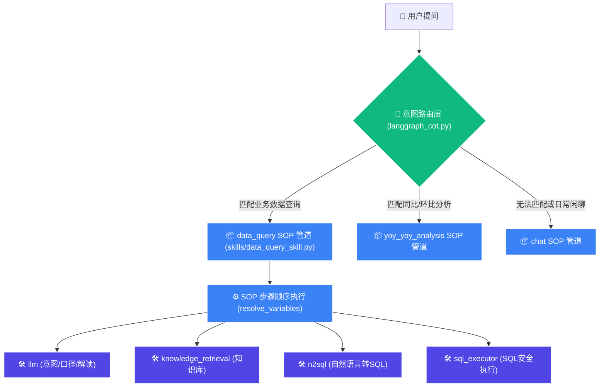

# Cot Research ChatBI PoC 项目回顾与后续规划

本项目是一个基于 **Skill (声明式业务 SOP) + MCP (原子工具协议)** 双层架构的 ChatBI 概念验证系统（PoC）。它通过 LangGraph 作为双层调度引擎，将用户复杂的自然语言数据分析诉求，映射到标准的业务工作流，并最终通过原子工具对底层数据库进行查询与解读。

---

## 1. 核心架构回顾

本项目的核心设计理念是 **意图路由（Skill Router） + 声明式工作流管道（Standard Workflow Engine） + 原子工具（MCP Tools）**。



### 关键目录与文件
1. **`langgraph_cot.py`**: 双层决策引擎的核心实现。负责将用户提问路由到特定 Skill，并以声明式机制顺序执行 Skill 包含的 MCP 步骤，自动处理变量槽管道传输（Data Piping）。
2. **`app_config.py`**: 集中化的配置管理入口。统一处理数据库、大语言模型以及 Mock 演示模式的参数读取，且隔离了真实密钥文件 `.env`。
3. **`skills/` (业务 SOP 层)**: 声明式的业务工作流。例如 `data_query_skill.py` 规定了“意图识别 $\rightarrow$ 知识检索 $\rightarrow$ N2SQL $\rightarrow$ SQL执行 $\rightarrow$ 数据解读 $\rightarrow$ 数据口径”的标准 SOP 流程。
4. **`mcps/` (原子工具层)**: 严格对接 Anthropic 官方 Model Context Protocol 规范的原子工具集。采用驼峰命名 `inputSchema`，可无缝对接外部生态。
5. **`streamlit_langgraph.py`**: Web 可视化调试界面。清晰展示 SOP 动态执行图、思维链（CoT）展开卡片、入参及 Raw 返回结果，方便全链路调试。

---

## 2. 已完成的工作（基线已稳固）

目前系统已通过全部 14 个 pytest 单元测试，并实现了一键式健康检查验证，主要完成了以下五个维度的升级：

### ✅ M1: 安全与可运行基线
* **凭据隔离**: 删除了源码和文档中硬编码的真实数据库连接信息，提供 `.env.example`，敏感参数全部由系统环境变量或 `.env` 隔离读取。
* **依赖补齐**: 补齐了 `langgraph`、`pytz`、`python-dotenv` 等核心库声明，支持一键安装。
* **本地启动**: 本地已可以通过 `streamlit run streamlit_langgraph.py` 进行可视化演示。

### ✅ M2: 完整离线 Mock 演示链路
* **离线运行**: 在未配置 API Key 和数据库连接时，系统会自动 fallback 至 `APP_MODE=mock`。
* **模拟返回**: `llm` 采用本地规则意图判断，`n2sql` 返回静态示例 SQL，`sql_executor` 返回模拟格式化表格，确保离线状态下仍然能展示出完整的 SOP 决策思维链。

### ✅ M3: 运行中断与优雅退化
* **状态契约标准化**: 统一了 MCP 工具返回结构，均包含 `success`、`data`、`error`、`error_type`。
* **异常拦截与中断**: 若任一 SOP 关键节点执行失败（如 SQL 报错、模型请求 401），LangGraph 引擎会立刻捕获并中断执行，将标准错误展示于 Streamlit 界面，不再向下伪造最终答案。

### ✅ M4 (部分): SQL 执行安全护栏
* **多维度校验**: 在 `sql_executor_mcp.py` 中实现了 SQL 安全过滤器，严格执行以下安全防护：
  1. 仅限 `SELECT` 查询（禁止 `DROP`、`DELETE`、`UPDATE` 等操作）。
  2. 仅支持单条 SQL 语句执行（拦截多语句拼接攻击）。
  3. 表白名单机制（仅能查询 `DB_ALLOWED_TABLES` 指定的表）。
  4. 结果行数硬上限控制（避免慢查询与大内存占用）。

---

## 3. 后续开发规划（What's Next）

根据之前的开发排期 `doc/后续开发计划_codex_20260522.md`，目前我们已经拥有了极佳的可运行基线，接下来的核心任务将集中在**功能闭环**、**配置外置化**、**真实数据库对接与联调**上：

### 🛠️ 任务一：SQL 纠错与重试闭环 (Milestone 4.5 - P1)
> [!NOTE]
> 目前 SQL 如果执行失败（例如字段拼错、语法错误），工作流会直接硬性中断。在真实大模型应用中，由于模型存在幻觉，极易在第一次生成 SQL 时产生微小瑕疵，需要具备纠错能力。
* **目标**: 当 `sql_executor` 发生除安全拦截外的异常时，不立刻中断，而是触发一个“SQL纠错”节点（使用 LLM 并传入报错信息和原 SQL 重新生成），重试最多 1-2 次，若仍失败再中断。
* **实现路径**: 
  1. 在 `skills/data_query_skill.py` 的 flow 步骤中定义纠错分支，或者在 `langgraph_cot.py` 的执行引擎层捕获 `sql_executor` 的失败后，在引擎内部执行循环重试。

### ⚙️ 任务二：表结构与口径配置外置化 (Milestone 5 - P2)
> [!NOTE]
> 当前 `mcps/n2sql_mcp.py` 里的表结构字段描述（如 `period_td`、`wholesale_qty`）以及 `skills/data_query_skill.py` 中的口径逻辑都是硬编码写在 Python 代码内的字符串里。
* **目标**: 将这部分描述数据从代码中剥离，集中保存在外部配置文件（如 `config/metadata.yml`）中。
* **实现路径**:
  1. 新建 `config/metadata.yml` 专门定义表结构、字段含义以及业务统计口径。
  2. 修改 `n2sql_mcp.py` 和 `skills` 的读取逻辑，启动时自动解析此 YAML 文件，让表结构对大模型动态可见。

### 🔬 任务三：环境自检与用户手动测试 (P1)
* 准备运行以下命令手动体验可视化 Web 端：
  ```powershell
  # 启动 Streamlit UI
  streamlit run streamlit_langgraph.py
  ```
* 对照 [6.2 用户手动测试] 的 7 大场景（普通查询、同环比、闲聊、空数据、危险 SQL、缺失配置等）在本地 Mock 模式下进行回归演练。

### 🔗 任务四：对接真实环境（Real Mode 联调前置准备）
要想脱离 Mock，真正实现连接到用户的企业真实数据库与大模型服务，需要确保以下条件到位：
1. **模型凭证**: 在 `.env` 中提供 `DEEPSEEK_API_KEY` 或 `OPENAI_API_KEY`，并配置对应的 `MODEL_BASE_URL` 与 `MODEL_NAME`。
2. **只读账号**: 需要提供真实数据库的连接配置。出于绝对安全考虑，该数据库账号**必须为只读权限**（READ-ONLY），严禁提供可写/可管理的账号。
3. **白名单表**: 检查 `.env` 中的 `DB_ALLOWED_TABLES`，确保已经配置了我们所允许查询的所有视图或数据表名称。
4. **验证命令**: 网络和配置连通后，使用健康检查工具检验真实连接：
   ```powershell
   python scripts/check_mcps.py --mode real
   ```
